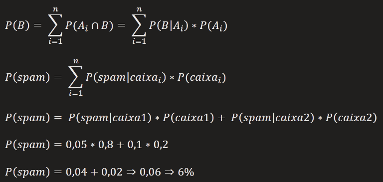

# Probabilidade total, parcial e Teorema de Bayes

### Introdução

Pela estatística, sabemos que a probabilidade é uma forma de quantificar a incerteza associada a uma amostra escolhida dentro de um conjunto universo. A probabilidade para um único evento é dada pelo quociente entre o número de eventos favoráveis e o número de eventos possíveis.

Essa relação é válida pra encontrarmos a probabilidade para um único evento. Para relacionar probabilidades entre dois ou mais eventos, ou achar novas probabilidades a partir das que temos, contamos com as fórmulas de Probabilidade Condicional, Probabilidade Total e Teorema de Bayes.

### Probabilidade condicional
A Probabilidade Condicional é usada para calcular a probabilidade de um evento A ocorrer dado que um evento B já ocorreu.

Ela é dada pela razão entre a probabilidade da intersecção dos eventos pela probabilidade do evento que já ocorreu.

**Exemplo**

|          | São Paulo | Rio de Janeiro | Belo Horizonte |     | Total |
| -------- | --------- | -------------- | -------------- | --- | ----- |
| Sim      | 100       | 150            | 150            |     | 400   |
| Não      | 125       | 130            | 95             |     | 350   |
| Não sabe | 75        | 170            | 5              |     | 250   |
|          |           |                |                |     |       |
| Total    | 300       | 450            | 250            |     | 100   |

a- Determine a probabilidade da pessoa ter dito sim.  
b- Determine a probabilidade da pessoa ser do Rio de Janeiro.  
c- Determine a probabilidade da pessoa ser de Belo Horizonte.  
d- Determine a probabilidade da pessoa ter dito que não e que é de Belo Horizonte.  

### Teorema da probabilidade total
O Teorema da Probabilidade Total diz que a probabilidade de um evento B ocorrer é a soma das probabilidades das intersecções do evento B com as partições A de outro evento A.

Vamos ver a ilustração do evento B e as partições A, onde o evento B é a intersecção com cada uma das partições.

Ou seja, a probabilidade de B ocorrer é a somatória da probabilidade de B dada a partição, vezes a probabilidade da partição

**Exemplo**

João tem duas caixas de e-mail. Na primeira, 5% dos e-mail são spam, enquanto na segunda, 10% são spam. Do total de e-mails, 80% estão na primeira caixa e 20% na segunda. Escolhendo um e-mail aleatório de João, qual a probabilidade de ser spam?

**Resolução**

Primeiro vamos encontrar a probabilidade do e-mail ser spam e a probabilidade de qual caixa ele pertence.

Probabilidade spam  
P(spam|caixa1) = 0,05  
P(spam|caixa2) = 0,10

Probabilidade da caixa  
P(caixa1) = 0,8
P(caixa2) = 0,2

### Teorema de Bayes
O teorema de Bayes deriva da probabilidade condicional. Ele relaciona as probabilidades condicionais entre dois eventos da seguinte forma:

**Exemplo**

Um teste diagnóstico para determinada doença D só pode resultar em positivo ou negativo, indicando presença ou ausência da doença. Estima-se que a probabilidade de um falso negativo (ou seja, a pessoa tem a doença e o teste deu negativo) seja 1% e a probabilidade de uma falso positivo seja 5% (ou seja, a pessoa não tem a doença e o teste deu positivo).

A taxa de incidência da doença é baixa, ocorrendo um caso por mil habitantes.

Se um pessoa selecionada ao acaso na população for submetida ao teste e o resultado der positivo, qual a probabilidade dessa pessoa ter a doença D?

**Resolução**

Montar árvore de decisão para entender os resultados  

Vamos mapear as probabilidades dadas pelo enunciado.  
P(d) = 0,001  
P(d') = 1 - P(d) = 0,99

Probabilidades de quem tem a doença  
P(n|d) = 0,01  
P(p|d) = 0,99  
P(p|d') = 0,05  
P(n|d') = 0,95

d = tem doença  
d' = não tem doença  
n = teste negativo  
p = teste positivo

Agora vamos calcular as probabilidades dos ramos da árvore de decisão

P(d)*(p|d) = 0,001 * 0,99 = 0,00099
P(d)*(n|d) = 0,001 * 0,01 = 0,00001
P(d')*(n|d') = 0,99 * 0,05 = 0,0495
P(d')*(p|d') = 0,99 * 0,95 = 0,9405

Agora vamos calcular a probabilidade de ter a doença, dado que o teste deu positivo.  

A probabilidade da pessoa sorteada já ter a doença e o resultado ser positivo é de 1,94%

### Conclusão
Na estatística para relacionar probabilidades entre dois ou mais eventos ou achar novas probabilidades a partir das que temos, contamos com os teoremas de probabilidade condicional, probabilidade total e Teorema de Bayes.

03:00