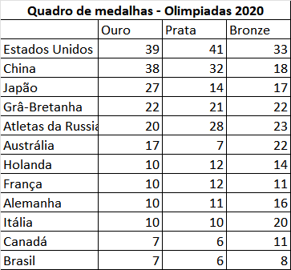
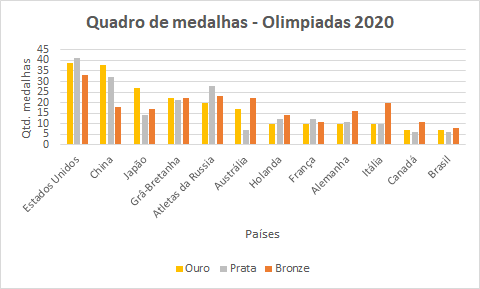
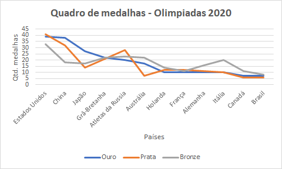
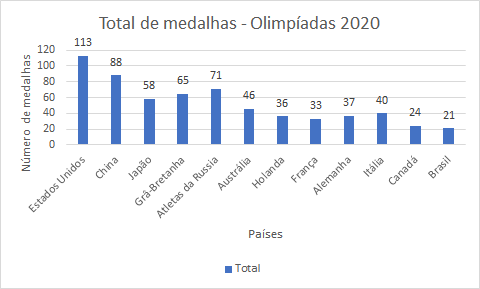
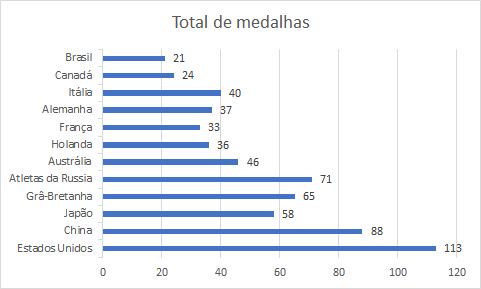
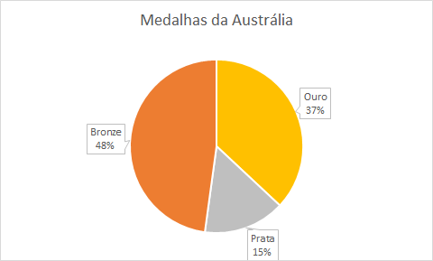

# Visualização gráfica dos dados

 

### Introdução

Os gráficos são representações que facilitam a análise de dados. As informações em um gráfico devem estar disposta de maneira simples, clara e verídica. Para isso alguns elementos são fundamentais como título, eixos, legenda, rótulos e linhas.

Exemplo de gráficos

* Gráfico de linhas
* Gráfico de colunas
* Gráfico de barras
* Gráfico de setores
* Histograma
* Diagrama de caixas
* Gráfico de dispersão

#### Gráfico de linhas
O gráfico de linha é utilizado para demonstrar um sequência numérica de um certo dado ao longo do tempo. é indicado para demonstrar evoluções ou regressões que ocorrem em sequência para que o comportamento dos fenômenos e suas transformações sejam observadas. 

#### Gráfico de colunas
Um gráfico de colunas, é composto por duas linhas ou eixos, um vertical e outro horizontal. Muitas vezes é conhecido como gráfico de barras. 

#### Gráfico de barras
Tem a mesma finalidade que o gráfico de colunas, mas pode ser apresentado através de barras horizontais ou horizontais.

#### Gráfico de setores
O gráfico de setores, também conhecido como de pizza, é construído com base em um círculo e é empregado sempre que desejamos ressaltar a participação do dado no total.

#### Histograma
Histograma é formado por um conjunto de retângulos justapostos, cujas bases se localizam sobre o eixo horizontal, de tal modo que seus pontos médio coincidem com os pontos do intervalos das classes. A área de um histograma é proporcional à soma das frequências simples ou absolutas.

#### Diagrama de caixas
Na estatística, o boxplot ou diagrama de caixa, é uma maneira gráfica de representar a alteração dos dados de uma variável por meio de quartis.

#### Gráfico de dispersão
São utilizados na análise do relacionamento entre duas variáveis.

### Conclusão
Os gráficos são representações que facilitam a análise de dados. As informações em um gráfico devem estrar dispostas de maneiras simples, clara e verídica. Para isso alguns elementos são fundamentais como título, eixos, legenda, rótulos e linhas.

Existem vários tipos de gráficos para diferentes tipos de variáveis e análise. É importante conhecer as vantagens e desvantagens de cada um deles.

