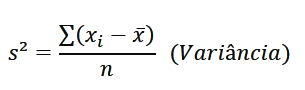
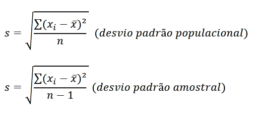
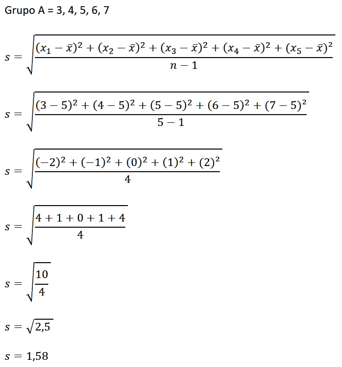

# Medidas de posição e medidas de dispersão (variabilidade)

### Introdução
Para entender as características gerais de uma amosta, um gráfico é uma ótima opção, porém muitas vezes precisamos fornecer um resumo que seja representativo, usando apenas um valor.

* Medidas de posição
  * Moda
  * Média
  * Mediana
  * Quartis
  * Percentis
* Medidas de variabilidade e dispersão
  * Amplitude total
  * Variância e desvio padrão

#### Moda
É o valor que ocorre com maior frequência dentro de um conjunto de dados.  

Exemplo:  
|1 3 4 5 5 5 6 7 7 8 9|  
A moda do conjunto é o número 5, pois se repete 3 vezes

|2 3 6 8 8 9|  
A moda deste conjunto é o número 8, pois se repete 2 vezes

|1 2 2 3 3 4 5|  
A moda do conjunto é 2 e 3.  
Esse grupo é considerado bimodal, pois possui mais de um valor que se repetem mais vezes e na mesma quantidade

|1 2 3 4 5|  
Quando um conjunto não possui um valor moda, o conjunto é chamado de amodal.

#### Média
A média é obtida através da soma de todos os elementos do conjunto, dividido pela quantidade de elementos.

Exemplo:  
|1 3 5|  
A média do conjunto é igual a 3.  
Soma dos elementos = 9  
Total de elementos = 3  
Média = 9/3 => 3

#### Mediana
É o valor que ocupa a posição central no conjunto dos dados.

Exemplo:  
|9 3 5|  
Primeiro devemos ordenar os dados do conjunto  
|3 5 9|  
A mediana do conjunto é o número 5, pois este ocupa a posição central do conjunto, possuindo a mesma quantidade de valores e esquerda e a direita

Caso um conjunto possui dois valores como mediana, o valor final sera a media entre os dois números.  
|3 5 5 7|  
A mediana do conjunto é 5, pois a média dos dois valores medianos do conjunto é 5.

#### Quartis
Valores de uma série, divididos em quatro partes iguais

|----|---|---|---|  
---Q1-Q2-Q3

A mediana do conjunto é o valor da Q2

|1 3 5 6 8 9 11 15 16 18 20|

Q2 do conjunto = 9

Dividimos o conjunto a partir do valor da mediana  

|1 3 5 6 8 | e |11 15 16 18 20|  

Para o Q1, vamos encontrar a mediana do primeiro grupo, que é o numero 5 a mediana do segundo grupo será o Q3, que é o numero 16.

Assim temos Q1 = 5, Q2 = 9 e o Q3 = 16.

Então podemos dizer que antes do Q1, temos 25% dos valores do conjunto, antes do Q2, temos 50% do conjunto, antes do Q3 temos 75% dos dados e acima do Q3 temos 100% dos dados.

|25%|25%|25%|25%|  
-----5----9---16

#### Percentis
Funcionamento semelhante ao quartil, porem o conjunto é divido em 100 partes, onde termos os indicadores P1, P2, P3, P4 .... P100.

P25 terá o mesmo valor que o Q1 do quartil.
P50 terá o mesmo valor que o Q2 do quartil.
P75 terá o mesmo valor que o Q3 do quartil.

### Medidas de dispersão e variabilidade

#### Amplitude
Representa a variação dos valores do conjunto.
Para obter a amplitude devemos primeiros organizar os elementos do conjunto e realizar uma subtração, do maior menos o menor valor do conjunto.

Exemplo:  
|3 4 5 6 7|
Amplitude -> 7 - 3 = **4**  

|5 5 5 5 5|  
Amplitude -> 5 - 5 = **0**

#### Variância e desvio padrão

#### Variância
Formula de variância  

lê-se = s² é igual ao somatório dos elementos do conjunto menos a média, elevado ao quadrado e divido pelo numero de elementos  

### Desvio padrão
Para obter o desvio padrão, basta resolver a raiz da variância

  

Exemplo  
