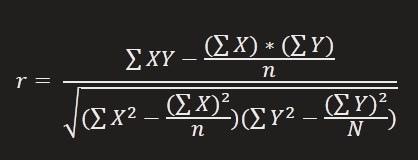
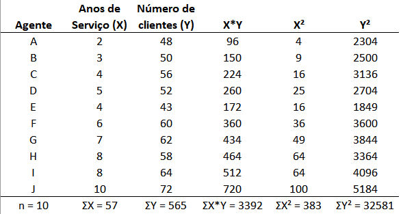
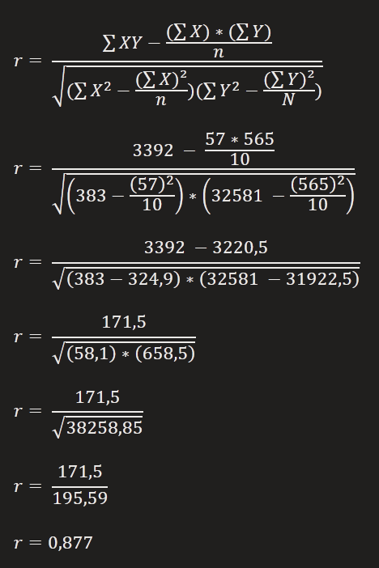

# Análise bidimensional

### Introdução

O principal objetivo da análise bidirecional pe explorar relações (similaridades) entre as variáveis, descrevendo os seus relacionamentos.

Existem 3 possibilidades de relacionar as variáveis:
* As duas varáveis são qualitativas.
* As duas variáveis são quantitativas.
* Uma variável é qualitativa e outra quantitativa.

Quando temos duas variáveis quantitativas, a relação entre elas é chamada de **correlação**.

| Agente | Anos de serviço(X) | Número de clientes(Y) |
| ------ | ------------------ | --------------------- |
| A      | 2                  | 48                    |
| B      | 3                  | 50                    |
| C      | 4                  | 56                    |
| D      | 5                  | 62                    |
| E      | 4                  | 43                    |
| F      | 6                  | 60                    |
| G      | 7                  | 62                    |
| H      | 8                  | 58                    |
| I      | 8                  | 64                    |
| J      | 10                 | 72                    |

Pode-se definir que existe uma relação entre o tempo de serviço e o numero de clientes 

#### Tipos de correlação

* **Correlação linear positiva**
Existe quando se é possível imaginar um traçado em linha reta acendente ao eixo Y

* **Correlação linear negativa**
Existe quando se é possível imaginar um traçado em linha reta descendente ao eixo Y

* **Correlação não linear**
Existe quando se é possível imaginar um traçado linear em parabola.

* **Correlação não existente**
Quando não se encaixa em nenhum dos casos anteriores.

### Coeficiente de correlação
O coeficiente de correlação de Pearson (r), também chamado de correlação linear ou r de Pearson, é um grau de relação entra duas variáveis quantitativas e indica o grau da intensidade de correlação, além do sentido dessa correlação (positivo ou negativo).

Uma das fórmulas para calcular o coeficiente de correlação de Pearson é:

Os limites de r são -1 e 1.  
Se r = 1, há uma correlação perfeita e positiva entre as variáveis.  
Se r = -1, há uma correlação perfeita e negativa entre as variáveis.
Se r = 0, ou não há correlação entre as variáveis ou a relação que porventura exista, não é linear.

O resultado de 0,877, indica uma correlação linear positiva

### Conclusão
Quando duas variáveis estão ligadas por uma relação estatística, dizemos que existe correlação entre elas.

A correlação linear mais conhecida é a de Pearson, e indica o grau de associação entre duas variáveis. Esse valor pode variar de -1 a +1, sendo "+1 correlação linear perfeita positiva", "-1 correlação linear perfeita negativa" e "0 correlação não linear ou sem correlação entre as duas variáveis".

Tome cuidado na hora de interpretar o valor matemático da correlação pois, na vida real, nem toda correlação implica em casualidade.