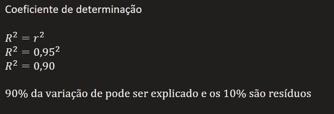

# Regressão Linear Simples

### Introdução
Quando analisamos a relação entre duas variáveis, determinamos a **correlação** entre elas, ou seja, como e o quanto essas variáveis quantitativas estão relacionadas.

Análise de **regressão** estuda determinada variável em função de outra. O seu objetivo é descrever, através de um modelo matemático, a relação entre duas variáveis a partir de N observações (e também fornecer um método de previsão que permita a avaliação em termos de confiabilidade, permitindo a transformação da incerteza em risco).

A variável sobre a qual desejamos fazer uma estimativa recebe o nome de variável dependente e a outra recebe o nome de variavel independente.

A dependência de uma variável, que indicaremos por Y, em relação à outra variável, que indicaremos por X, é estudada, em Estatística, por uma técnica denominada regressão.

Qual o prazo estimado para uma entrega de 900km??

#### Equação de uma reta

### Coeficiente de determinação
O coeficiente de determinação, que se indica por R², é, matematicamente, igual ao quadrado do coeficiente de correlação (caso a regressão seja linear e simples).

Varia, portanto, entre 0 e 1;  
0 <= R² >= 1

O valor de R² mostra a força da relação linear entre X e Y. Se a reta da regressão passa exatamente sobre os pontos do diagrama de dispersão, R² = 1. Nesse caso a correlação linear é perfeita. Toda variação em Y está relacionada com variação em X.

Se os valores de X aumentam e Y varia ao acaso, não existe relação linear entre as variáveis, assim, o valor do coeficiente de determinação R² deve ser zero ou bem próximo de zero.

O coeficiente de determinação pode ser entendido como a proporção de variação de uma variável que é explicada pela variação de outra variável. Mede-se assim, a contribuição de X na previsão de Y.

### Conclusão
A análise de regressão estuda a relação entre duas variáveis por meio de um modelo matemático que permite a estimação da variável dependente. A reta de regressão linear explica a relação independente Y e a variável dependente X. A equação da reta de regressão linear é dada como Y = aX + b, sendo 'a' o coeficiente angular da reta e 'b' o coeficiente linear.

O coeficiente de determinação R² mostra a forma da relação linear entre X e Y. Varia de 0 a 1. Matematicamente é igual ao quadrado do coeficiente de correlação de Pearson.

Com isso, conseguimos descrever a relação entre duas variáveis através de uma equação, a contribuição de uma variável e a previsão de outra.