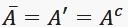

# Derivadas - Introdução à probabilidade

### Introdução
Existem muitas situações que envolvem incertezas: fenômenos ou experimentos aleatórios. Um modelo matemático ajudará a investigar de maneira bastante precisa esse fenômeno.

Encontramos na natureza dois tipos de fenômenos:
* Determinísticos: os resultados são sempre os mesmos e determinados pelas condições sob as quais o procedimento seja executado.
* Não-Determinístico (Probabilístico ou Aleatório): são aplicados em situações que envolvem incerteza. Os resultados variam de uma observação para outra. As condições do experimento determinam apenas o comportamento probabilístico do resultado observável.

Fenômenos aleatórios, onde situações ou acontecimentos cujos resultados não podem ser previstos com certeza, dependem do acaso.

Quando o experimento é executado repetidamente, sob as mesmas condições, os resultados individuais parecem ocorrer de uma forma casual (acidental). No entanto, à medida que o número de repetições aumenta, surgem certos padrões na frequência de ocorrência dos resultados. É esta regularidade (ou padrão) que torna possível construir um modelo matemático para analisar o experimento.

### Conceitos importantes
O ponto central em todas as situações onde usamos probabilidade é a possibilidade de quantificar quão provável é determinado evento.

**Espaço amostral**  
é uma lista com todos os resultados possíveis de um experimento.

**Evento**  
É qualquer subconjunto do espaço amostral. Cada evento tem determinada característica, que o distingui dos outros.

#### Exemplo:

**Espaço amostral**  
S = {1, 2, 3, 4, 5, 6} => possibilidades de resultados ao rolar um dado

**Eventos**  
Resultado ser par  
A = {2, 4, 6} => Quando um evento possui mais de um resultado, é chamado de **Evento composto**

Resultado maior que 3  
B = {4, 5, 6} => Quando um evento possui mais de um resultado, é chamado de **Evento composto**

Resultado maior que 5  
C = {6} => Quando o evento possui apenas um elemento é chamado de **Evento elementar**

Resultado igual a 7  
D = {∅ ou vazio} => Quando o evento não possui nenhum elemento, é chamado de **Evento impossível**.

Resultado maior que 0  
E = {1, 2, 3, 4, 5, 6} => Quando o evento possui todos os resultados do espaço amostral, é chamado de **Evento certo**

#### Combinação de eventos
Uma forma de determinar o espaço amostral é através do diagrama de Venn, em que o espaço amostral é determinado por um retângulo e os eventos por círculos

Se A e B são eventos de um mesmo espaço amostral S, diremos que ocorre o evento:

* A **união** B, A **soma** B ou A **mais** B, se e somente se A ocorre ou B ocorre.
  * A ∪ B está representado pela parte azul do diagrama abaixo

* A **produto** B, A **vezes** B, ou A **interseção** B, se e somente se A ocorre e B ocorre simultaneamente
  * A ∩ B está representada pela parte azul do diagrama

* Complementar de A (não A), se e somente se A **não** ocorre.
  *  está representando em azul no diagrama

* A **menos** B, A **diferença** B, se e somente se A ocorre e B não ocorre
  * A - B esta representado no diagrama abaixo.

* Eventos mutuamente excludentes (exclusivos)
  * Dois eventos A e B são mutuamente excludentes se não puderem ocorrer juntos. A ∩ B = ∅

### Propriedades das operações entre eventos
* Idempotentes  
A ∪ A = A   
A ∩ A = A

* Comutativas   
A ∪ B = B ∪ A  
A ∩ B = B ∩ A

* Associativas  
(A ∪ B) ∪ C = A ∪ (B ∪ C)  
(A ∩ B) ∩ C = A ∩ (B ∩ C)

* Distributivas  
A ∪ (B ∩ C) = (A ∪ B) ∩ (A ∪ C)  
A ∩ (B ∪ C) = (A ∩ B) ∪ (A ∩ C)

* Absorções  
A ∪ (A ∩ B) = A  
A ∩ (A ∪ B) = A

* Identidades  
A ∩ S = A  
A ∪ S = A  
A ∩ ∅ = ∅  
A ∪ ∅ = A

* Complementares  
S' = ∅  
∅' = S  
A ∩ A' = ∅  
A ∪ A' = S  
(A')' = A

* Leis de Morgan (ou Leis das dualidades)  
(A ∪ B)' = A' ∩ B'  
(A ∩ B)' = A' ∪ B'

* Outras propriedades  
A ∩ B' = A - B
A' ∩ B = B - A

### Exercícios

**1**  
Lançam-se 2 moedas  
Seja:  
A = saída de faces iguais.  
B = saída de cara na primeira moeda.

1 moeda => s={cara, coroa}  
2 moedas => s={(cara, cara), (cara, coroa), (coroa, cara), (coroa, coroa)}

Evento A =>{(cara,cara), (coroa, coroa)}  
Evento B => ((cara, cara), (cara,coroa))

Para facilitar a leitura, podemos substituir os nomes por letras. Cara = c e Coroa = r  

Evento A =>{(c,c), (r,r)}  
Evento B => {(c,c), (c,r)}

Determine
* A ∪ B = {(c,c), (r,r),(c,r)}
* A ∩ B = {(c,c)}  
* A' = {(c,r), (r,c)}  
* B' = {(r,r), (r,c)}  
* A' ∩ B' = {(r,c)}
* A' ∪ B' = {(c,r),(r,c),(r,r)}
* (A ∪ B)' = {(r,c)} ou A' ∩ B'
* (A ∩ B)' = {(c,r),(r,c),(r,r)} ou A' ∪ B'
* B - A = {(c,r)}
* A - B = {(r,r)}
* A' ∩ B = {(c,r)} ou B - A
* B' ∩ A = {(r,r)}  ou A - B

### Conclusão
Na natureza, existem fenômenos que quando repetimos obtermos sempre o mesmo resultado, que são chamados determinísticos. Os fenômenos probabilísticos, também conhecidos como aleatórios, ao serem repetidos inúmeras vezes, apresentam regularidade em termos de frequência.

O conjunto de resultados de uma experiência aleatória é chamado de espaço amostral. Um evento é um subconjunto de um espaço amostral.