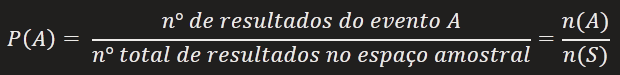
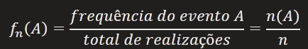
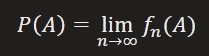
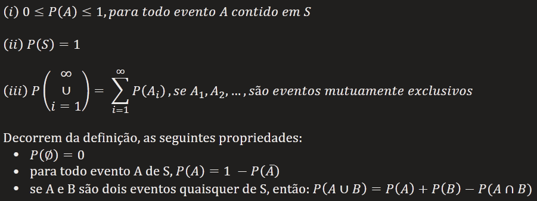
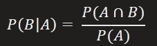

# Probabilidade

### Introdução

O estudo de probabilidades teve inicio com os jogos de azar. As pessoas queria entender a "lei" desses jogos, para ganhar dinheiros nos cassinos. Só que os matemáticos acabaram descobrindo que não é possível prever, por exemplo, se vai ocorrer a face 6 em um determinado lançamento de um dado. Podemos apenas descobrir, por observação, que a face 6 ocorre 1/6 das vezes, no decorrer de muitas jogadas.

Atualmente, o estudo de probabilidade vai além do jogos de azar. A probabilidade está no nosso dia a dia. Por exemplo, em um jogo de futebol, jogar uma moeda para decidir quem começa um jogo evita o favoritismo. Pela mesma razão, os estatísticos recomendam escolher ao caso as pessoas que vão responder às pesquisas de opinião. O favoritismo é indesejável.

Na natureza, existem fenômenos probabilísticos, também conhecidos como aleatórios, que envolvem incerteza, os resultado variam de uma observação para outra. Porém, esses fenômenos, ao serem repetidos inúmeras vezes, apresentam regularidade em termos de frequência.

### Definição de probabilidade

***Definição clássica***  
A definição clássica diz que a probabilidade de ocorrer um evento com determinada característica de interesse é dado pelo quociente entre o número de eventos favoráveis e o número de eventos possíveis.

**Exemplo**  

Quais as possibilidades de resultado ao jogar uma moeda?  
S = {cara, coroa}

Obter a face cara  
A = {cara}

Qual a probabilidade dos eventos de A?

n(S) = 2
n(A) = 1

P(A) = n(A)/n(S) => 1/2 => 0,5 ou 50%

A chance de ocorrer o evento A é de 50%

***Definição frequentista***
A definição frequentista considera o limite de frequências relativas como o valor de probabilidade. Se um experimento aleatório é repetido um número grande de vezes, **n**, e seja n, o número de ocorrências do evento A, a probabilidade de A é dada por: 

**Exemplo**

Vamos realizar varias jogadas com uma moeda e analisar a quantidade de vezes que o resultado deu cara

|      | fn1       | fn2        | fn3          | fn4           |     | P(A) |
| ---- | --------- | ---------- | ------------ | ------------- | --- | ---- |
| cara | 2/5 = 0,4 | 6/10 = 0,6 | 22/50 = 0,44 | 47/100 = 0,47 |     | 0,5  |
| n    | 5         | 10         | 50           | 100           |     | ∞    |

Quando n -> infinito (n tende ao infinito), fn(A) se aproxima de P(A). 

### Tipos de agrupamento

***Definição axiomática***
A probabilidade de uma evento A é definida como sendo um número P(A) satisfazendo os axiomas:

**Exemplo**  

Lançamento de um dado  
S = {1, 2, 3, 4, 5, 6}

Evento A = Obter resultado par na face superior  
A = {2, 4, 6}

P(A) = 3/6 => 1/2  
Probabilidade do evento A = 1/2 ou 0,5 ou 50%

Evento B = Obter resultado menor ou igual a 6  
B = {1, 2, 3, 4, 5, 6}

P(B) = 6/6 => 1
Probabilidade do evento B = 100%, pois B é igual ao espaço amostral

Evento C = Obter número maior que 7
C = ∅

Probabilidade do evento C = 0 ou impossível

### Eventos independentes
Dizemos que dois eventos são independentes quando a realização ou não-realização de um dos eventos não afeta a probabilidade da realização do outro e vice-versa.

Dois eventos são independentes se e somente se P(A ∩ B) = P(A) * P(B)

**Exemplo**

Smoeda = {cara, coroa}
Sdado = {1, 2, 3, 4, 5, 6}

Evento A = número impar no dado  
A = {1, 3, 5}

Evento B = moeda ser cara  
B = {cara}

P(A ∩ B) = P(A) * P(B) = 3/6 * 1/2 = 3/12 = 1/4

### Eventos mutuamente exclusivos
Eventos mutuamente exclusivos (excludentes) ou eventos disjuntos.

Dizemos que dois eventos são disjuntos ou mutuamente excludentes quando a realização de um exclui a realização do(s) outro(s).

Assim, no lançamento de uma moeda, o evento "tirar cara" e o evento "tirar coroa" são mutuamente excludentes, já que, ao se realizar um deles, o outro não se realiza.

Se dois eventos são mutuamente excludentes, A ∩ B = ∅ e portanto P(A ∩ B) = 0

**Exemplo**

Sdado = {1, 2, 3, 4, 5, 6}

Evento A = Resultado par ou maior que 3  
A = {2, 4, 5, 6} -> P(A) = 4/6

Evento B = Resultado maior que 3  
B = {4, 5, 6} -> P(B) = 3/6 = 1/2

A∩B = {4, 5, 6} -> P(A∩B) = 3/6 = 1/2

P(A∪B) = P(A) + P(B) − P(A∩B)  
P(A∪B) = 4/6 + 1/2 - 1/2 => 4/6 => 2/3

### Probabilidade condicional
Probabilidade condicional é um dos conceitos mais importantes da teoria de probabilidades, pois frequentemente se quer calcular seu valor quando se tem uma informação parcial a respeito do resultado de um experimento aleatório.

Além disso, mesmo quando não se tem essa informação parcial, as probabilidades condicionais muitas vezes são utilizadas para computar mais facilmente valores de probabilidades que se tem interesse.

Mais importante do que isso, o conceito por trás de probabilidades condicionais é de que nós conseguimos atualizar a nossa medida de incerteza a partir do momento que conhecemos uma informação nova.

Sejam A e B dois eventos de um espaço amostral S, com P(A) > 0.

A probabilidade condicional de B, dado A, denotada por P(B|A), é definida por:  

**Exemplo**

Qual a probabilidade de ao jogar dois dados simultaneamente, a soma dos resultados ser 5 ?  

dadoA = {1, 2, 3, 4, 5, 6}  
dadoB = {1, 2, 3, 4, 5, 6}

S = {(1,1), (1,2), (1,3), (1,4), (1,5), (1,6), ..., (6,6)}

S(A+B=5) = {(1,4), (2,3), (3,2), (4,1)}  
n(A+B=5) = 4

P(A+B =5) = 4/36 = 1/9  
A probabilidade da soma dos dados ser igual a 5 é 1/9 ou aprox. 11,1%

E se jogarmos o segundo só apos a obtenção do resultado do primeiro, muda alguma coisa?

S(dadoA=2) = {(2,1), (2,2), (2,3), (2,4), (2,5), (2,6)}

S(A+B=5 | A=2) = {(2,3)}
n(S) = 1

P(A+B=5 | A=2) = 1/6  
Probabilidade da soma dos dados ser igual a 5, dado que o primeiro dado deu 2, é igual a 1/6 ou 16,6%

### Conclusão
Na natureza existem os fenômenos probabilísticos também conhecidos como aleatórios, que envolvem incerteza, os resultados variam de uma obervação para outra. Porém, esses fenômenos ao serem repetidos inúmeras vezes apresentam regularidade em termos de frequência.

A probabilidade é uma medida com a qual podemos esperar a chance de ocorrência de um determinado evento, atribuindo um número (valor) entre 0 e 1. Assim, se temos a certeza de que um evento ocorrerá, diremos que sua probabilidade é 1 (100%). Caso contrário diremos que sua probabilidade é 0 (0%).