# Análise combinatória

### Introdução
A análise combinatória estuda os problemas de contagem. Ela surgiu da necessidade de se calcular o número de possibilidades que podem ocorrer numa certa experiência, sem precisar descrever cada um dessas possibilidades.

Em muitos problemas costumamos usar contagens diretas, mas em outros, a enumeração torna-se bem trabalhosa.

Surgiu, então, a necessidade de utilizarmos algumas técnicas mais refinadas.

***Princípio Fundamental da Contagem (PFC)***  
Na análise combinatória, o princípio fundamental da contagem consiste em separar o problema em etapas. O número total de possibilidades vai ser o produto das possibilidades em cada etapa.

**Exemplo**

Um sistema de senha utiliza números (1 a 9) e letras (A a Z) para montar uma senha. A senha possui um número e uma letra

números = 9 possibilidades
letrar = 26 possibilidades

total_possibilidades = 9*26 = 234 possibilidades de combinações.

**Exemplo2**

Uma lanchonete oferece 3 opção de carne e 3 opções de queijos para o hambúrguer e duas opções de bebidas. Quantas combinações são possíveis?

carnes = {bovina, suína, frango}  
queijos = {mussarela, cheddar, prato}
bebidas = {refrigerante, suco}

total_combinações = 3 * 3 * 2 = 18 combinações possíveis

### Tipos de agrupamentos
* Arranjo
Usamos o arranjo para calcular o número de possibilidades para formar um grupo ordenado de P elementos, dentre N elementos disponíveis. O número de possibilidades para um arranjo é: 

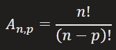
___
### Relembrando fatorial (n!)

n! = n * (n-1) * (n-2) * (n-3) * ... * (n-n)

5! = 5 * 4 * 3 * 2 * 1 = 120
10! = 10 * 9 * 8 * 7 * 6 * 5 * 4 * 3 * 2 * 1 = 3.628.800
1! = 1
0! = 1
___

**Exemplo**

Uma turma de 20 alunos realizará uma votação de representante e vice de turma. O mais votado será eleito o representante e o segundo mais votado será o vice.  
Quantas combinações são possíveis de se ter na turma.

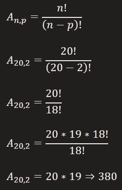

Podemos ter 380 combinações diferentes em entre representante e vice de turma.

* Permutação
As permutações são agrupamentos ordenados, onde o número de elementos (n) do agrupamento é igual ao número de elementos disponíveis. Note que a permutação é um caso especial de arranjo quando o número de elementos é igual ao número de agrupamentos. Desta forma, o denominador na fórmula do arranjo é igual a 1 na permutação.

O número de possibilidades para uma *permutação simples* é:  
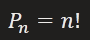

**Exemplo**

De quantas formas diferentes 6 pessoas podem se sentar em um banco de 6 lugares?  
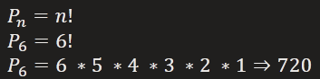

A *permutação com repetição* é uma permutação em que alguns dos elementos são iguais, ou se repetem algumas vezes. Dividimos o número de elementos pelo produtos dos fatoriais do números de repetições. Para uma permutação de N elementos, em que um dos elementos se repete as vezes, outro B vezes e um terceiro C vezes, o número de possibilidades será: 

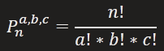

**Exemplo**

Quantas permutações existem na palavra OVO?  
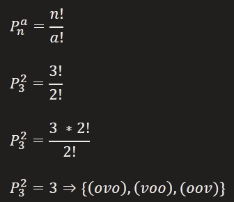

* Combinação
Usamos a combinação para formar grupos não ordenados de **p** elementos, dentre os **n** disponíveis. A principal diferença para o arranjo é que na combinação a ordem não importa. A combinação é dada por:  

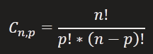

**Exemplo**

Foram abertas 3 vagas na comissão organizadora de um evento e 10 pessoas se candidataram. De quantas maneiras distintas essa comissão poderá ser formada.

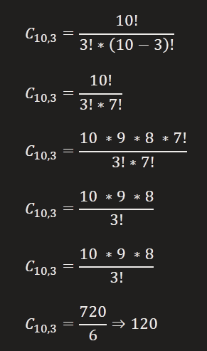

A comissão pode ter 120 combinações diferentes de eleitos

### Probabilidade de análise combinatória
A Probabilidade permite analisar ou calcular as chances de obter determinado resultado diante de um experimento aleatório. A probabilidade é determinada pela razão entre o número de eventos possíveis e número de eventos favoráveis, sendo apresentada pela seguinte expressão:

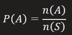

Sendo:
P(A) = probabilidade de ocorrer um evento A  
n(A) = número de resultados favoráveis  
n(S) = número total de resultados possíveis

Para encontrar o número de casos possíveis e favoráveis, muitas vezes necessitamos recorrer às fórmulas estudadas em análise combinatória.

**Exemplo**

Qual a probabilidade de um apostador ganhar o prêmio máximo da Mega Sena, fazendo uma aposta miníma, ou seja, apostar exatamente nos seis números sorteados?

aposta = 6 números aleatórios, não importando a ordem e sem repetição
espaço amostral = 60 números no total, sem repetição

Primeiro vamos fazer uma combinação  
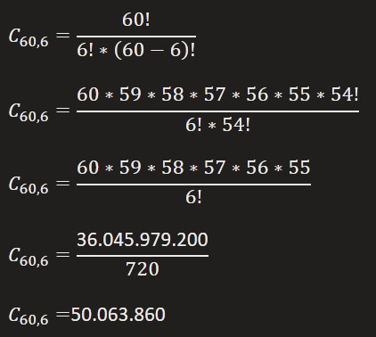

Identificamos que existem 50.063.860 combinações de 6 números que podem ser sorteadas

Agora vamos calcular a probabilidade de acertar os 6 números sorteados com uma aposta miníma

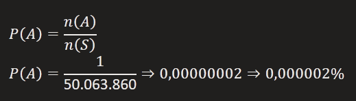

Podemos agora dizer que a chance de acertar os 6 números da Mega Sena, com uma aposta miníma é de aproximadamente 0,000002%

### Conclusão
Para a Estatística e Probabilidade, é fundamental que possamos dimensionar o espaço amostral, ou seja, calcular quantas possibilidades existem para um determinado evento. Para isso, usamos a análise combinatória. Ela consiste no principio fundamental da contagem, arranjo e permutação quando a ordem importa, e combinação quando a ordem não importa.