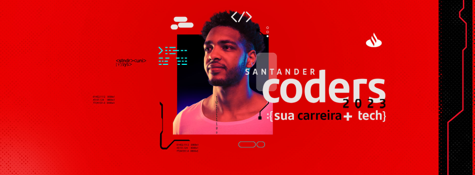

# Trilha Digital | Data Science

Repositório contendo anotações realizadas durante o bootcamp Santander Coder's que foi realizada pela [Ada Tech (Let's Code)](https://ada.tech/)

Essas anotações são da trilha digital, o primeiro passo no processo Santander Coder's

Nesse momento foram abordados os seguintes assuntos
* [Git e Versionamento](Git/)
* Cálculo Básico
* [Algoritmos](Algoritmos/)
* [Python](Python/)
* [Estatística](Estatistica/) - Em curso
* Bando de Dados - Aguardando finalizar módulo anterior
* Introdução ao SQL e PowerBI - Aguardando finalizar módulo anterior

### Ferramentas utilizadas
* VSCode - Para anotações em formato .md, criação de scripts .py
* Excel - Para montagem de tabelas e gráficos
* OneNote - Para montagem visual de equações
* Calculadora - Para cálculos rápidos